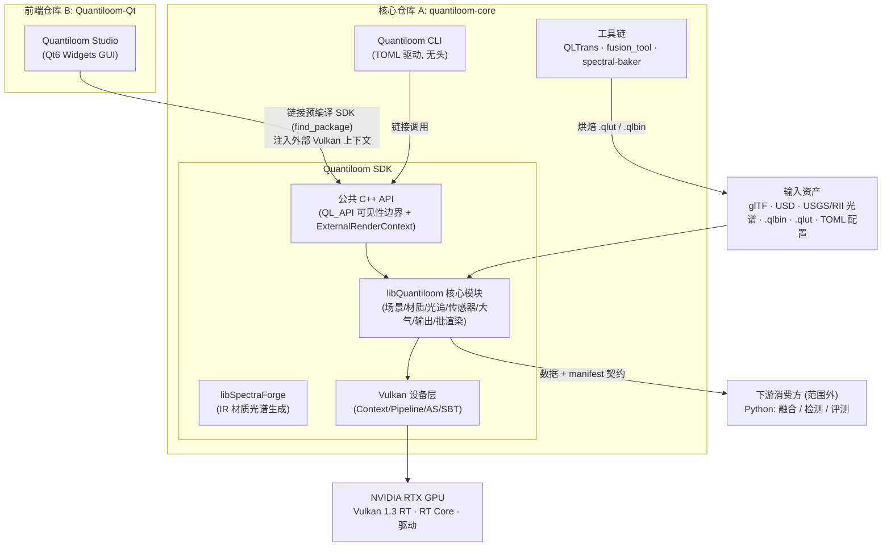
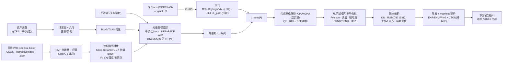

# Quantiloom 软件需求规范（SRS）

**面向可见光–红外的物理光谱光追渲染器与仿真数据生成系统**

| 项 | 内容 |
|---|---|
| 文档标题 | Quantiloom 软件需求规范（Software Requirements Specification） |
| 文档编号 | QTL-SRS-001 |
| 版本 | v0.2 |
| 状态 | 基线草案 |
| 覆盖范围 | Quantiloom SDK（libQuantiloom + libSpectraForge）、`Quantiloom` CLI、配套工具（QLTrans / fusion_tool / spectral-baker）、Quantiloom Studio（Qt6 GUI，仓库 Quantiloom-Qt） |
| 技术选型 | C++20 · Vulkan 1.3 · 硬件光追（VK_KHR_ray_tracing_pipeline / NVIDIA RTX RT Core）· HLSL→SPIR-V |
| 关联文档 | 《面向复杂环境感知的可见光与红外光谱成像仿真系统与多模态融合研究》开题报告 |

> 本 SRS 描述"需要做成什么（What）"与"必须满足的约束（Constraints）"，不规定"具体怎么实现（How）"；实现细节归属设计文档（SDD）。融合、检测、评测等下游研究模块不在本系统实现范围内，本文档仅为其定义数据契约（见 §5.10、§7.3）。


---

## 1. 引言

### 1.1 目的

本文档规定 Quantiloom 系统的软件需求，作为设计、实现、测试与验收的共同基线。目标读者包括：核心渲染引擎开发者、GUI 前端开发者、下游融合/检测算法研究者（作为数据消费方）、以及论文评审与验收方。

Quantiloom 的核心价值在于：以**物理一致的光谱射线追踪**为基础，在统一的辐射度量与单位体系下，生成从可见光到长波红外（VIS/SWIR/MWIR/LWIR）波段的、带有可追溯辐射真值的成对多模态成像数据，用于支撑多模态感知算法研究与成像系统论证。它与"仅追求视觉相似"的常规图形渲染的本质区别在于：输出的是可计量、可复现、带物理量纲的辐射量与传感器计数，而非艺术化的像素灰度。

### 1.2 文档范围

本 SRS 覆盖以下可分离交付的软件组件：

1. **Quantiloom SDK（核心后端，仓库 Quantiloom-dev）** —— 两个共享库及其头文件、CMake 包配置：
   - **libQuantiloom**（输出名 `Quantiloom`）：渲染器核心，承载全部物理仿真能力——光谱路径追踪、材质与光谱数据、传感器成像链、大气、输出编码、批量渲染与 Vulkan/GPU 抽象；
   - **libSpectraForge**：红外材质光谱生成库（基于纹理分析的 IR 发射率/反射率曲线推断）。
2. **`Quantiloom` CLI（随核心仓库编译）** —— 面向开发者与批处理的命令行工具，TOML 配置驱动，用于无 GUI 环境下的场景渲染、批量出数据、回归测试与诊断。
3. **配套工具（随核心仓库编译/维护）** —— `QLTrans`（MODTRAN 包装器，生成 `.qlut` 大气 LUT）、`fusion_tool`（多波段融合调试工具）、`scripts/spectral-baker`（离线烘焙光谱基 `.qlbin` 与材质 JSON）。
4. **Quantiloom Studio（Qt6 GUI，独立仓库 Quantiloom-Qt）** —— 面向用户的图形前端，以预编译 Quantiloom SDK（`find_package(Quantiloom)`）消费核心能力，提供场景编辑、参数调节、交互预览、批量生成与可视化。

**明确不在范围内**（Out of Scope）：图像融合算法、目标检测模型、评测指标计算的具体实现。这些由外部 Python 生态承担，本系统只对其负责数据的正确产出与接口契约的稳定（§5.10）。

### 1.3 术语、定义与缩略语

| 缩写 | 全称 / 含义 |
|---|---|
| SDK / ABI / API | 软件开发工具包 / 应用二进制接口 / 应用编程接口 |
| RHI | 渲染硬件接口（Render Hardware Interface），对 Vulkan 的内部抽象层 |
| SPD | 光谱功率分布（Spectral Power Distribution），光源的波长–功率描述 |
| BRDF / BSDF / BTDF | 双向反射 / 散射 / 透射分布函数 |
| HWSS | Hero 波长光谱采样（Hero Wavelength Spectral Sampling） |
| MIS | 多重重要性采样（Multiple Importance Sampling） |
| BLAS / TLAS | 底层 / 顶层加速结构（Bottom/Top-Level Acceleration Structure） |
| RSR | 相对光谱响应（Relative Spectral Response），含滤光片、光学、探测器 QE 综合响应 |
| QE (η) | 量子效率（Quantum Efficiency） |
| MTF | 调制传递函数（Modulation Transfer Function） |
| PRNU / DSNU | 像元响应非均匀性 / 暗信号非均匀性 |
| FPN / NUC | 固定图样噪声 / 非均匀性校正 |
| NETD / NEDT | 噪声等效温差 |
| LUT | 查找表（Look-Up Table），此处指预计算大气辐射传输表 |
| DN | 数字计数（Digital Number / Counts） |
| VIS/SWIR/MWIR/LWIR | 可见光 / 短波 / 中波 / 长波红外 |
| 数据立方 | 高光谱数据立方体（Hyperspectral Data Cube），像素 × 波段 |
| glTF / USD | 工业级三维资产交换格式 / 通用场景描述（Universal Scene Description） |
| CIE 1931 | CIE 1931 标准色度观察者与色匹配函数 |
| EXR / ENVI | 高动态范围图像格式 / 遥感栅格格式（`.hdr` + `.dat`，BSQ/BIL/BIP 交织） |
| NEE | 下一事件估计（Next Event Estimation），向光源发射影子光线的直接光采样 |
| NMF 光谱基 | 非负矩阵分解光谱基压缩：光谱曲线离线分解为基函数 × 权重，运行时按 `spectrum = Σ wᵢ·basisᵢ` 重建 |
| `.qlbin` | Quantiloom 光谱基二进制格式（NMF 基 + 材质权重，由 spectral-baker 离线烘焙） |
| `.qlut` | Quantiloom 大气 LUT 格式（TOML 头 + 二进制表，含 τ 与 L_path，按波长/高度/角度三维索引，由 QLTrans 从 MODTRAN 生成） |
| ExternalRenderContext | SDK 的外部 Vulkan 上下文注入接口：GUI 传入自有 VkInstance/VkDevice/VkQueue，核心直接渲染进调用方交换链 |
| $L_{sens}(\lambda)$ | 传感器入瞳/像面处的光谱辐射亮度 |
| $\tau(\lambda), L_{path}(\lambda)$ | 大气透过率 / 大气路径辐射 |

### 1.4 参考资料

- 开题报告：《面向复杂环境感知的可见光与红外光谱成像仿真系统与多模态融合研究》
- Vulkan 规范：`VK_KHR_ray_tracing_pipeline`、`VK_KHR_acceleration_structure`、`VK_KHR_ray_query`、SPIR-V 扩展
- 物理与成像链参考：Hero 波长采样（Wilkie 等）、Image Chain Approach（Schott 等）、NIST HB 157（Tansock 等）、光子转移曲线/噪声分解（Janesick）、红外探测器噪声与探测极限（Rogalski）
- 数据源：USGS 光谱库、RefractiveIndex.info 折射率/消光系数库、CIE 色匹配函数、（可选）MODTRAN 驱动的大气 LUT

### 1.5 文档约定与需求标识规则

- 需求编号：`FR-<模块>-<序号>`（功能需求）、`NFR-<类别>-<序号>`（非功能需求）、`IF-<序号>`（接口需求）、`DR-<序号>`（数据需求）、`CON-<序号>`（约束）。
- 优先级采用 MoSCoW：**M**（必须，Must）/ **S**（应当，Should）/ **C**（可选，Could）/ **W**（本期不做，Won't-now）。
- **现状标注**：✅ 已实现并接入主链路 / 🟡 部分实现，或代码已写但未接线（present-but-not-wired）/ ❌ 未实现。未标注者为纯约束/非功能条目。
- "系统"泛指 Quantiloom 整体；当需要区分组件时显式写明 libQuantiloom / CLI / Studio。
- 关键词"必须/应当/可以"按 RFC 2119 语义理解。

---

## 2. 总体描述

### 2.1 产品定位与愿景

Quantiloom 是一个**前后端分离**的物理光谱成像仿真平台：

- **后端（libQuantiloom）** 是可独立复用的渲染/仿真内核，把"几何 + 光谱光源 + 波长相关材质 + 传感器成像链 + 大气"解算为带物理量纲的多波段输出。它不依赖任何 GUI 框架，可被 CLI、GUI、脚本、批处理集群等多种前端消费。
- **前端（Quantiloom Studio）** 只负责交互、编排与可视化，不承载物理逻辑；所有仿真都通过 SDK 完成。

这种分离带来的收益：物理内核可独立测试与回归、可无头（headless）批量出数据、可被第三方研究代码链接调用，而 GUI 迭代不污染核心正确性。

### 2.2 系统上下文与组件划分



组件与仓库对应关系：

| 组件 | 仓库 | 交付物 | 依赖 |
|---|---|---|---|
| libQuantiloom | A：`quantiloom-core` | SHARED 库（输出名 `Quantiloom`）+ 头文件（`QL_API` 导出）+ `QuantiloomConfig.cmake` | Vulkan SDK、GPU 驱动；可选 OpenUSD（`USD_ROOT`） |
| libSpectraForge | A：`quantiloom-core` | SHARED 库 | libQuantiloom |
| `Quantiloom` CLI | A：`quantiloom-core` | 可执行文件（TOML 配置驱动） | libQuantiloom |
| QLTrans / fusion_tool | A：`quantiloom-core` | 可执行工具 | libQuantiloom、MODTRAN（外部，QLTrans） |
| Quantiloom Studio | B：`Quantiloom-Qt` | GUI 可执行文件 | 预编译 Quantiloom SDK（`../Quantiloom-SDK/<平台>`）、Qt 6（Widgets/Charts） |

### 2.3 前后端分离原则（架构级约束）

- **CON-01（M）**：libQuantiloom **不得**依赖 Qt 或任何 GUI 框架；其公共头文件不得包含 GUI 类型。✅（现状满足）
- **CON-02（M）**：物理与算法逻辑**只允许**存在于 SDK（libQuantiloom / libSpectraForge）；CLI 与 Studio 不得重复实现或旁路核心算法。🟡 **现状已有违规，需迁移**：前端 Quantiloom-Qt 中现存 (a) PCHIP 单调三次插值实现（SpectralMaterialGenPanel），(b) 红外能量守恒 ρ=1−ε−τ 的曲线构造逻辑（MainWindow），(c) 手写 TOML 配置导出（ConfigManager，与核心 `Config::Load` 不对称）。三者应下沉至 SDK，前端仅保留调用。
- **CON-03（M）**：GUI 与 CLI 对核心的访问**只能**经由公共 API（`QL_API` 导出符号）；不得访问库内部私有符号。✅（构建启用 `-fvisibility=hidden`，非导出符号不可见）
- **CON-04（M，v0.2 改写）**：公共 API 边界为 **C++ SDK**：`QL_API` 导出宏 + `find_package(Quantiloom)` CMake 包 + SemVer。GUI 集成经 `ExternalRenderContext` 注入外部 Vulkan 上下文（同进程、共享 VkDevice，核心直接渲染进调用方交换链）。公共头允许暴露 `std::`/`glm::`/Vulkan 类型；因此**消费方须与 SDK 同工具链构建**。稳定 C ABI 与语言绑定列为 **W**（本期不做）——它无法承载 Vulkan 上下文共享这一核心集成模式，收益不抵成本。

### 2.4 用户画像与干系人

| 角色 | 关注点 | 主要交互组件 |
|---|---|---|
| 核心引擎开发者 | 正确性、性能、可测试性、API 稳定 | libQuantiloom、CLI |
| GUI 前端开发者 | API 易用性、稳定性、事件/进度回调 | Quantiloom SDK、Studio |
| 仿真使用者（研究者/学生） | 配置场景与传感器、生成数据集、可视化 | Studio、CLI |
| 下游算法研究者 | 数据格式、辐射真值、配准与标签、可复现 | 数据契约（§7.3） |
| 论文评审 / 验收方 | 物理正确性证据、可复现实验、指标 | 全部 |

### 2.5 运行环境

| 项 | 需求 |
|---|---|
| 操作系统 | Windows 10/11 x64（主）；Linux x64（应支持，CI 与无头批处理） |
| GPU | 支持 Vulkan 光追扩展的 NVIDIA RTX 系列（含硬件 RT Core），如 RTX 40 系；显存 ≥ 8 GB（建议 ≥ 12 GB） |
| 图形栈 | Vulkan 1.3+，启用 `VK_KHR_acceleration_structure`、`VK_KHR_ray_tracing_pipeline`、`VK_KHR_ray_query`、`VK_KHR_buffer_device_address` |
| 编译器 | 支持 C++20 的 MSVC / Clang / GCC（GCC<14 需规避已知 ICE，降级 `-O1`） |
| GUI 运行时 | Qt 6（Widgets + Charts + OpenGL 模块；非 QML）（Studio） |
| 构建系统 | CMake ≥ 3.21（两仓库统一），第三方依赖经 CPM.cmake 锁定版本 |
| 可选依赖 | OpenUSD（`USD_ROOT` 指定；未设置时 USD 支持编译剔除，CI 默认无 USD 构建） |

### 2.6 设计与实现约束

- **CON-05（M）**：语言为 C++20；着色器以 HLSL（含少量 GLSL 阶段文件）编译至 SPIR-V。✅
- **CON-06（M）**：GPU 后端为 Vulkan；求交与加速结构遍历必须走硬件光追路径（RT 管线 + SBT，RT Core），不得以纯软件 BVH 遍历替代主路径。✅
- **CON-07（C，v0.2 降级）**：设备层为直接的 Vulkan 封装类（Context/Pipeline/AS），**不设**独立 RHI 抽象层；未来若需多后端再引入抽象，本期不为不存在的后端付抽象税。
- **CON-08（M）**：全流程采用统一的辐射度量与单位体系（见 §7.1），谱域计算在连续/离散波长栅格上进行，仅在必要输出端做 RGB 转换。
- **CON-09（S）**：第三方依赖须许可证兼容且可离线构建（CPM 锁定版本 + `.cpm_cache` 缓存 / vendored）。✅

### 2.7 假设与依赖

- 目标场景规模在单机单卡可容纳范围内（数万至数百万三角面元量级）；超大规模分布式渲染不在本期。
- 大气效应以"参数化 + LUT 插值"工程化引入；不内嵌逐像元在线 MODTRAN 解算。
- 偏振维度作为**可选扩展**预留接口，本期默认关闭（标量/非偏振）。
- 假设已有 GPU 工作站与 Vulkan SDK、深度学习框架（下游）等环境（对应开题报告研究基础）。

---

## 3. 系统架构与数据流

### 3.1 libQuantiloom 内部模块划分

libQuantiloom 按目录划分为六个模块，公共接口经 `QL_API` 导出（约 38 个公共头）：

| 模块 | 职责 | 现状 |
|---|---|---|
| `core/` | 平台/导出宏、日志、配置（TOML）、基础类型、CIE CMF 数据 | ✅ |
| `io/` | glTF（tinygltf）/USD（OpenUSD，可选）装载、USGS 光谱导入、光谱基 `.qlbin` 装载、`.qlut` 大气 LUT 装载、EXR/PNG/ENVI 读写 | ✅（`.qlut` 已可加载但未接入渲染，见 §5.5） |
| `scene/` | 场景图（节点+变换）、材质模型（含 IR 发射率/温度/复折射率引用）、网格与优化 | ✅ |
| `renderer/` | Vulkan 设备与光追管线（RT pipeline + BLAS/TLAS + SBT）、大气参数、纹理管理、`ExternalRenderContext`（GUI 集成）、GPU 传感器链编排 | ✅ |
| `postprocess/` | CPU 传感器链（GenericSensor）、多波段融合 | ✅ |
| `hs_core/` | 高光谱渲染器、批量渲染（BatchRenderer，含取消/进度回调）、GPU 光谱重建、自适应波长栅格 | ✅ |

原 v0.1 设想的独立"编排层（Session/Job/Scheduler）"不存在，编排职责由 `hs_core/BatchRenderer` 与调用方（CLI/GUI）分担；跨场景批量队列尚缺（见 FR-JOB-03）。

### 3.2 端到端数据流



### 3.3 渲染模式

**执行模式**（两种，复用同一核心解算路径）：

| 模式 | 目标 | 特征 | 主要消费方 | 现状 |
|---|---|---|---|---|
| 交互式渐进预览 | 供调参、所见即所得 | 逐帧累积渐进收敛、参数改动重置累积、经 `ExternalRenderContext` 渲染进 GUI 交换链 | Studio 视口 | ✅ |
| 离线批量成片 | 生成数据集真值 | 按目标 spp 收敛、完整传感器链与噪声、无头运行 | CLI（TOML 驱动）、Studio 批量面板（待建） | 🟡 单配置已可；批量队列与确定性种子缺失 |

**光谱配置模式**（`[spectral].mode`，现已实现六种）：`single`（单波长）、`rgb`（光谱上采样 + CIE 积分）、`multispectral`（高光谱立方，逐波长多 pass）、`swir_fused` / `mwir_fused` / `lwir_fused`（红外波段融合）。波段划分为 VIS / NIR / SWIR / MWIR / LWIR 五段，各段配 NMF 光谱基（16/16/32/32/32 维）。

两执行模式产出在物理量定义上一致（预览可为其近似）。

---

## 4. 外部接口需求

### 4.1 Quantiloom SDK 公共 API（IF-API）

- **IF-01（M，v0.2 改写）**：公共 API 为 **C++ 接口**，以 `QL_API` 导出宏为唯一符号边界（构建启用隐藏可见性）；GUI 交互式集成经 `ExternalRenderContext` 注入外部 Vulkan 上下文（VkInstance/VkDevice/VkQueue，Vulkan 1.3 + 动态渲染）。✅
- **IF-02（M）**：接口须为**无 GUI、可无头**调用；一次完整"装载场景 → 配置传感器/大气 → 提交渲染 → 取回结果"流程不依赖任何窗口系统。✅（CLI 即此路径）
- **IF-03（M）**：渲染作业支持进度回调、取消与错误信息查询。🟡（`BatchRenderer` 有 `Cancel()` + 进度回调、`HyperspectralProgress` 回调已有；统一的日志回调与错误码体系待补）
- **IF-04（M）**：结果以显式内存缓冲交付（辐射量/DN/RGB/数据立方分通道可取），并附带完整元数据；调用方决定是否落盘。🟡（EXR 元数据完备；内存缓冲取回路径部分依赖落盘）
- **IF-05（S）**：语义化版本（SemVer）；破坏性变更须升主版本并提供迁移说明。同工具链构建约束见 CON-04。🟡（版本号已有，策略未成文）
- **IF-06（M，v0.2 升级）**：提供 CMake `find_package(Quantiloom)` 导出目标（`Quantiloom::libQuantiloom`、`Quantiloom::libSpectraForge`），这是前端消费 SDK 的**唯一**方式，故为 M。✅（含 install/export；`libSpectraForge` 头文件 INTERFACE_INCLUDE_DIRECTORIES 缺失的 workaround 应修复）
- **IF-07（W，v0.2 降级）**：C ABI / Python 等语言绑定本期不做（见 CON-04 理由）。下游 Python 消费经文件 + manifest 契约（§7.3），不经进程内绑定。

### 4.2 `Quantiloom` 命令行接口（IF-CLI）

> 设计原则（v0.2 确立）：**TOML 配置文件是唯一事实来源**，CLI 不提供参数覆盖 flag——同一份 TOML 即同一次渲染的完整描述，天然可复现、可归档。分辨率、光谱模式、采样数、传感器、大气、输出路径均在 TOML 中定义（`[renderer]/[spectral]/[camera]/[lighting]/[scene]/[hyperspectral]/[sensor]/[atmospheric]/[quality]` 等节）。

- **IF-08（M）**：`Quantiloom <config.toml>`：按配置渲染单场景，全程无头。✅
- **IF-09（M）**：`Quantiloom batch <批量清单>`：按清单顺序执行多份 TOML 配置（多场景/多参数扫描），产出成对多模态数据集与 manifest；单项失败记录并跳过，不拖垮整队列。❌（核心 `BatchRenderer` 仅覆盖单场景内逐波段批渲染，跨配置队列缺失）
- **IF-10（S）**：`Quantiloom validate`：运行内置一致性/回归检查（能量守恒/白炉、参考场景比对）。❌（现有 `scripts/validation`、`scripts/physics-audit` 为离线 Python 流程，未收编为 CLI 子命令）
- **IF-11（S）**：`Quantiloom info`：打印设备/扩展/能力与版本。❌
- **IF-12（M）**：非零退出码表征失败；关键步骤输出结构化日志（可选 JSON），便于 CI 与脚本消费。🟡（spdlog 分级日志已有；退出码语义与 JSON 日志未约定）

### 4.3 Quantiloom Studio 用户界面（IF-GUI）

- **IF-13（M）**：场景视口，展示交互式渐进预览，支持相机导航（轨道/平移/缩放/飞行）。✅（`QVulkanWindow` + `ExternalRenderContext` 直渲交换链，WASD/轨道/平移/缩放齐全）
- **IF-14（M）**：场景图/大纲面板，管理几何、实例、层级与变换。🟡（树形展示 + 选中 + gizmo 变换 + undo/redo 已有；视口点选拾取、节点增删改名缺失）
- **IF-15（M）**：材质面板，绑定与实时调节波长相关材质参数，展示所绑光谱曲线。✅（材质编辑面板 + 光谱材质生成面板：QtCharts 绘制 n/k/Fresnel R0 曲线、RII YAML/CSV 导入、"应用到材质"上传 GPU）
- **IF-16（M）**：光源/相机/传感器/大气配置面板（曝光、噪声参数、大气预设等）。🟡（光照/大气/传感器/光谱配置/显示增强/调试可视化面板齐全；独立相机面板缺失——相机仅由 TOML 与交互导航控制）
- **IF-17（M）**：波段/波长栅格与输出通道选择；光谱曲线、数据立方切片可视化。🟡（单波长选择 + 高光谱范围配置已有；**数据立方切片查看器/逐波段浏览缺失**）
- **IF-18（M）**：批量任务面板：编排多场景/多参数扫描、队列进度、取消、产物浏览。❌
- **IF-19（S）**：进度条、日志窗、错误提示均来自 SDK 回调，界面在长任务期间保持响应（不阻塞 UI 线程）。❌（前端零多线程；渐进预览靠逐帧事件循环尚可，但离线成片会冻结 UI；Start/Stop Render 为 TODO 空壳；无日志窗，状态栏进度条从未被驱动）
- **IF-20（S）**：工程文件保存/加载（场景 + 传感器 + 大气 + 渲染设置的可复现工程）。🟡（TOML 配置导入/导出已有，但导出部分字段取默认值而非面板实时状态，有损；"保存场景"为 TODO 空壳）

### 4.4 数据格式接口（IF-DATA）

| 方向 | 类别 | 格式 | 需求 | 现状 |
|---|---|---|---|---|
| 输入 | 几何/场景 | glTF 2.0（tinygltf）、USD（OpenUSD，可选构建，含 PointInstancer） | IF-21（M）解析几何、变换、实例；缺失贴图不阻断 | ✅ |
| 输入 | 光谱反射/发射 | USGS splib07、CSV 光谱曲线；离线烘焙为 NMF 光谱基 `.qlbin` + 材质 JSON | IF-22（M）导入并绑定到材质节点（glTF `extras` 引用） | ✅ |
| 输入 | 折射率/消光 | RefractiveIndex.info（n,k）：离线经 spectral-baker 烘焙；RII YAML 直读 | IF-23（M）复折射率供介电/金属求值 | 🟡（烘焙路径 ✅；C++ 端 RII 直读解析器标注 future，YAML 读取部分在前端） |
| 输入 | 渲染/传感器配置 | TOML（`[sensor]`：QE、井容、位深、积分时间、噪声、增益；`[atmospheric]`、`[spectral]` 等） | IF-24（M）参数化定义可见光/红外传感器 | ✅（RSR 曲线级 profile 缺失，见 FR-SEN-01） |
| 输入 | 大气 LUT | `.qlut`（TOML 头 + 二进制，τ + L_path，波长/高度/角度三维） | IF-25（M）加载、插值并接入渲染 | 🟡（加载与查询 ✅；**未接入渲染管线**） |
| 输出 | HDR 图像 | OpenEXR（多通道 + 元数据；`_rawdn.exr` 原始 DN） | IF-26（M）辐射量与多波段无损输出 | ✅ |
| 输出 | 高光谱立方 | ENVI（`.hdr`+`.dat`，BSQ/BIL/BIP，自研读写）——**主格式**；HDF5 已移除（v0.2 决策：W） | IF-27（M）像素 × 波段，带波长轴与单位 | ✅ |
| 输出 | 显示图像 | PNG（色调映射预览） | IF-28（S）DN/RGB 可视化输出 | ✅ |
| 输出 | 契约/清单 | JSON manifest（见 §7.3） | IF-29（M）描述每份产物的物理量、参数、配准与标签 | ❌（现仅 EXR 头内嵌元数据 + ENVI `.hdr`，无独立 manifest） |

### 4.5 硬件与软件接口

- **IF-30（M）**：通过 Vulkan 1.3+ 与 NVIDIA 驱动交互，使用加速结构与光追管线扩展及 SPIR-V。
- **IF-31（M）**：启动时探测所需扩展与能力，缺失时给出明确诊断而非崩溃（NFR-可靠性）。
- **IF-32（S）**：第三方库（数学、图像 IO、glTF/USD 解析、日志等）通过包管理或 vendored 方式锁定版本。

---

## 5. 功能需求

> 除特别说明，功能需求由 libQuantiloom 承载；CLI 与 Studio 通过 API 触发。优先级列 P，现状列 St。

### 5.1 场景与资产管理（FR-SCN）

| ID | P | St | 需求 |
|---|---|---|---|
| FR-SCN-01 | M | ✅ | 解析并装载 glTF 2.0 与 USD 场景（USD 为可选构建项，依赖 `USD_ROOT`），重建几何、变换矩阵与实例关系 |
| FR-SCN-02 | M | ✅ | 场景图（节点 = 变换 + 网格引用）支持运行时更新（`SetNodeTransform` + 加速结构重建） |
| FR-SCN-03 | M | 🟡 | 实例化几何复用网格、降低显存占用（USD PointInstancer 现为展开式实例化，网格级复用/TLAS 实例复用待确认与优化） |
| FR-SCN-04 | S | ❌ | 刚体动画/相机动画的时序场景（动态场景与多帧数据集）；glTF/USD 装载器均无动画导入 |
| FR-SCN-05 | S | 🟡 | 缺失资源（贴图/光谱/材质）时告警并以缺省值降级，不中断装载（glTF 路径已容错；策略未统一成文） |
| FR-SCN-06 | C | ✅ | 单位归一化：`[scene].world_units_to_meters` 装载时统一到米制 |

### 5.2 光谱数据与材质系统（FR-MAT）

材质系统是"物理正确"的关键：必须支持波长相关反射/透射/发射，覆盖 VIS→LWIR，能刻画非朗伯与方向性、波长选择性发射率等复杂特征（对应开题报告伪装/临边增亮等需求）。

**既定架构（v0.2 确认）**：光谱曲线不逐条上 GPU，而是离线（spectral-baker）经 NMF 分解为**波段光谱基 + 材质权重**（`.qlbin`），运行时按 `spectrum = Σ wᵢ·basisᵢ` 在 CPU/GPU 重建。红外属性（ε(λ)、透过率、温度、Kirchhoff 约束 ε+ρ+τ≤1）为材质一等公民。IR 材质光谱可由 libSpectraForge 从纹理分析自动生成。

| ID | P | St | 需求 |
|---|---|---|---|
| FR-MAT-01 | M | ✅ | 材质属性以波长为自变量定义（反射率/透射率/发射率随 λ 变化），在波长栅格上求值（NMF 基重建 + IR 曲线二分查找求值） |
| FR-MAT-02 | M | ✅ | 导入 USGS splib07 反射率曲线（含无效值标记处理、光谱仪自动识别）并绑定到材质节点（glTF `extras`） |
| FR-MAT-03 | M | 🟡 | RefractiveIndex.info 复折射率 (n,k) 用于金属/介电物理求值（着色器端 F0/复折射率采样 ✅；数据经离线烘焙进 `.qlbin`；C++ 端 RII 直读解析器待实现，现散落于前端，应下沉） |
| FR-MAT-04 | M | ✅ | 波长相关 BRDF/BSDF 求值与重要性采样：Cook-Torrance GGX（Smith 高度相关可见性、精确导体 Fresnel、原生标量光谱变体）+ 余弦加权漫反射采样 |
| FR-MAT-05 | M | 🟡 | 方向性、波长选择性发射率模型，用于红外热辐射（波长选择性 ε(λ) ✅；**方向性发射率/临边效应未实现**） |
| FR-MAT-06 | M | 🟡 | 几何/材质赋温度（常量 + 温度纹理），据普朗克定律参与红外自发辐射（数据模型与 blackbody 着色器 ✅，GPU 字段近期刚接线，物理验证未完成） |
| FR-MAT-07 | S | 🟡 | 光谱曲线重采样/插值到当前波长栅格，越界/缺采样有明确策略与告警（求值已有；越界策略与告警未成文统一） |
| FR-MAT-08 | S | 🟡 | 材质参数可经 TOML `[material]` 节外部覆盖（供参数扫描），并记录于产物元数据 |
| FR-MAT-09 | S | 🟡 | 解析 BRDF 模型库接入渲染路径：`BRDFModels`（五参数混合、RossThick-LiTransit 核驱动、Cox-Munk 海面、Otterman、Staylor-Suttles）**已实现但未接入 GPU 渲染**，作为地物/海面非朗伯散射能力应完成接线或明确移入验证工具 |
| FR-MAT-10 | C | ❌ | 预留偏振 pBRDF/发射维度扩展接口（默认关闭；现仅非偏振 Fresnel） |

### 5.3 加速结构与几何（FR-ACC）

| ID | P | St | 需求 |
|---|---|---|---|
| FR-ACC-01 | M | ✅ | 基于 `VK_KHR_acceleration_structure` 构建 BLAS/TLAS |
| FR-ACC-02 | M | ✅ | 求交与遍历走硬件 RT Core 路径（RT 管线 + SBT，`vkCmdTraceRaysKHR`） |
| FR-ACC-03 | S | 🟡 | 动态场景下 TLAS 刷新/重建与 BLAS 更新（编辑变换后全量重建已有；增量 refit 优化待做） |
| FR-ACC-04 | S | 🟡 | 大规模面片场景（数十万至百万级三角面元）可正常构建与渲染（未在该量级下系统性验证） |

### 5.4 光谱路径追踪核心（FR-PT）

**采样架构（v0.2 确立）**：谱域求解采用**单波长/单 pass、多 pass 拼波段**方案——每次光追 pass 经推送常量指定 `wavelength_nm`，全路径在该波长上标量求值，波段/立方由多 pass 累积装配。该方案物理无偏、实现简单，为正式架构；HWSS 作为后续效率优化（降低多 pass 开销与谱噪声）保留为 S。

| ID | P | St | 需求 |
|---|---|---|---|
| FR-PT-01 | M | ✅ | 在离散谱域上求解光谱版渲染方程，蒙特卡洛路径追踪（PCG 随机数，逐帧/逐样本播种） |
| FR-PT-02 | S | ❌ | （v0.2 由 M 降级）Hero 波长光谱采样（HWSS）：每路径主导波长推进、携带关联波长贡献，替代多 pass 以摊薄遍历开销；作为性能优化排期，不阻塞验收 |
| FR-PT-03 | M | 🟡 | 直接光 NEE（对日影子光线）与 BSDF 重要性采样（余弦漫反射 + GGX 镜面）均已实现，**但二者未经 MIS 权重合并**——存在贡献重复计入的物理正确性风险，须补 balance/power heuristic 并以白炉测试验证（这是物理债，不是性能项） |
| FR-PT-04 | M | ✅ | 光追管线按 RayGen / ClosestHit / Miss（+ 影子 Miss）组织，材质光谱求值与辐射度累积在着色器中完成 |
| FR-PT-05 | S | ✅ | 路径终止：最小贡献阈值截断、反射/折射俄罗斯轮盘 |
| FR-PT-06 | S | ❌ | 可选降噪（交互预览快速收敛用）；离线批量默认关闭或仅用不破坏物理量的降噪 |
| FR-PT-07 | C | 🟡 | 参与介质/体渲染：Woodcock/delta-tracking 与 Henyey-Greenstein 相函数**着色器代码已完成但从未被调用**——接线或删除，二选一，不许继续躺着 |
| FR-PT-08 | M | ✅ | 输出每像素、每波长的对象辐射亮度 $L_{obj}(\lambda)$，作为大气与传感器链输入 |

### 5.5 大气与介质（FR-ATM）

大气采用**双轨制**（v0.2 确认）：

- **轨道 A（解析模型，已接线）**：参数化 Rayleigh + Mie（β₅₅₀、标高、Mie g、Ångström 指数），沿视线路径做 Beer-Lambert 消光与内散射，带预设（clear_day/hazy/polluted_urban/mountain_top/mars/disabled），按场景尺度自动启停；MWIR/LWIR 另有大气温度参与热辐射下行。
- **轨道 B（MODTRAN LUT，待接线）**：QLTrans 生成 `.qlut`（τ + L_path，按波长/高度/角度三维），满足辐射传输分解：

$$
L_{sens}(\lambda) = \tau(\lambda)\,L_{obj}(\lambda) + L_{path}(\lambda)
$$

| ID | P | St | 需求 |
|---|---|---|---|
| FR-ATM-01 | M | 🟡 | 加载 `.qlut` 大气 LUT（含 $\tau(\lambda)$、$L_{path}(\lambda)$），按波长/高度/角度插值（**加载与查询已实现且有单测；未接入渲染管线**） |
| FR-ATM-02 | M | ❌ | 依上式将 $L_{obj}(\lambda)$ 修正为入瞳 $L_{sens}(\lambda)$（LUT 轨道的渲染端应用；这是 `.qlut` 资产大量就位后的**当前主线工作**） |
| FR-ATM-03 | S | 🟡 | 不同大气条件切换以开展敏感性实验（解析预设切换 ✅；`.qlut` 已按水汽/霾档位成套生成，切换机制待随 FR-ATM-02 落地） |
| FR-ATM-04 | S | ❌ | 记录 LUT 覆盖范围与插值越界告警，明确模型适用边界 |
| FR-ATM-05 | M | ✅ | （v0.2 新增，追认现实）解析 Rayleigh/Mie 大气：预设 + 参数化系数，沿视线消光与内散射，GPU 常量缓冲传参 |

### 5.6 传感器成像链（FR-SEN）

将谱域辐射映射为可计量的电子/计数，构建"物理量 → 传感器"的可追溯链路。核心积分与响应：

波段等效辐射亮度：

$$
L_{band} = \frac{\displaystyle\int RSR(\lambda)\,L_{sens}(\lambda)\,d\lambda}{\displaystyle\int RSR(\lambda)\,d\lambda}
$$

曝光时间 $t$ 内的期望光子数：

$$
\mu_{ph} = t\cdot A\Omega \int L_{sens}(\lambda)\,\tau_{opt}(\lambda)\,\frac{\lambda}{hc}\,RSR(\lambda)\,d\lambda
$$

**实现形态（v0.2 确认）**：传感器链存在 **CPU（GenericSensor，CLI 离线路径）与 GPU（compute 着色器链，GUI 交互路径）双实现**，两者必须保持数值一致（已有 `gpu_sensor_math`、`sensor_chain_order` 等单测约束）。

| ID | P | St | 需求 |
|---|---|---|---|
| FR-SEN-01 | M | ❌ | 以相对光谱响应 $RSR(\lambda)$ 曲线对 $L_{sens}(\lambda)$ 加权积分，得到波段/通道等效量（**现状为单标量 QE 峰值，无 RSR 曲线**——这是传感器链与"真实相机光谱响应"之间的主要差距） |
| FR-SEN-02 | M | 🟡 | 建模光学（焦距、F 数）、像元几何（pitch）、量子效率（现标量 η；$\tau_{opt}(\lambda)$ 曲线与 $A\Omega$ 显式建模待补） |
| FR-SEN-03 | M | ✅ | 按积分时间做积分曝光，辐射量 → 光电子数转换 |
| FR-SEN-04 | S | 🟡 | MTF 空间模糊与像元积分效应（现为高斯 PSF 模糊近似 + 渐晕；显式 MTF 曲线与像元积分待补） |
| FR-SEN-05 | M | 🟡 | 传感器参数（QE、井容、位深、增益、积分时间、噪声、探测器温度）经 TOML `[sensor]` 参数化 ✅；RSR 曲线级 profile 待随 FR-SEN-01 引入 |
| FR-SEN-06 | M | 🟡 | 多类传感器定义（可见光、SWIR/MWIR/LWIR）以生成成对多模态数据（各波段渲染模式 ✅；"同场景成对出图"的编排依赖 FR-JOB-03 批量队列） |

### 5.7 噪声与非均匀性（FR-NOISE）

噪声在**电子域**注入，保持光子/暗电流的泊松异方差特性与读出/量化的加性特性。前向模型：

$$
\begin{aligned}
N_{ph}   &\sim \mathrm{Poisson}(\mu_{ph}) \\
N_{d}    &\sim \mathrm{Poisson}(\mu_{d}) \\
n_{read} &\sim \mathcal{N}(0,\ \sigma_{read}^{2}) \\
N_{e}    &= \eta\,N_{ph} + N_{d} \\
N_{e}'   &= (1+\delta_{PRNU})\,N_{e} + \delta_{DSNU} + n_{read} + n_{1/f} \\
DN       &= \mathrm{clip}\!\big(\mathrm{round}(g\,N_{e}' + b)\big)
\end{aligned}
$$

| ID | P | St | 需求 |
|---|---|---|---|
| FR-NOISE-01 | M | ✅ | 光子噪声（Poisson）、暗电流噪声（Poisson）注入于电子域 |
| FR-NOISE-02 | M | ✅ | 读出噪声（高斯）、量化噪声（ADC 12/14/16 bit）建模 |
| FR-NOISE-03 | M | ✅ | 乘性 PRNU 与暗场固定图样 DSNU（含 NUC 开关） |
| FR-NOISE-04 | S | ❌ | 1/f 噪声、行列噪声等空间噪声模式（一维固定偏置 + 二维不均匀模式） |
| FR-NOISE-05 | M | 🟡 | 增益 $g$、偏置与量化/裁剪输出 DN ✅；可扩展非线性响应曲线待补 |
| FR-NOISE-06 | M | ✅ | 噪声在 GPU 端逐像素并行注入（compute 链：PSF→光电转换→Poisson→FPN→量化） |
| FR-NOISE-07 | M | 🟡 | 噪声参数全部可配置 ✅；**随机种子现由 `std::random_device` 混入，固定配置不可复现**——须提供固定种子模式（见 NFR-REPRO-01，P0 级缺陷） |

### 5.8 输出、色彩与编码（FR-OUT）

| ID | P | St | 需求 |
|---|---|---|---|
| FR-OUT-01 | M | ✅ | 输出带物理量纲的辐射真值（$L_{obj}/L_{sens}$）作为可追溯真值层（EXR + 头内元数据） |
| FR-OUT-02 | M | ✅ | 输出多波段图像与高光谱数据立方（ENVI BSQ/BIL/BIP，带波长轴与单位；可选逐波段中间产物） |
| FR-OUT-03 | M | ✅ | 输出传感器计数（DN）图像（`_rawdn.exr`） |
| FR-OUT-04 | M | ✅ | 经 CIE 1931 色匹配函数将光谱积分映射为 RGB（光谱上采样 + XYZ 积分），供显示/可视化 |
| FR-OUT-05 | S | 🟡 | 色调映射/显示增强（PNG 色调映射、GUI 端 CLAHE 面板）仅作用于显示层，不污染物理真值层（约束成立；白平衡等可配置项待补） |
| FR-OUT-06 | M | ✅ | 输出写入 EXR / ENVI / PNG（§4.4；HDF5 已裁撤为 W） |

### 5.9 渲染模式、调度与可复现（FR-JOB）

| ID | P | St | 需求 |
|---|---|---|---|
| FR-JOB-01 | M | ✅ | 交互式渐进预览：逐帧累积（滑动均值混合）、参数改动重置累积、即时反映 |
| FR-JOB-02 | M | 🟡 | 离线成片：按目标 spp 终止 ✅（含 CPU 传感器链与噪声）；按误差阈值自适应收敛 ❌ |
| FR-JOB-03 | M | ❌ | 跨配置批处理队列：多场景/多参数扫描（波段组合、噪声强度、大气条件）自动化生成成对数据（现 `BatchRenderer` 仅覆盖单场景内逐波段；对应 IF-09） |
| FR-JOB-04 | M | ❌ | 全流程随机种子可设定，固定种子 + 固定配置产出可复现结果（现 `std::random_device` 混入，**P0 缺陷**，见 NFR-REPRO-01） |
| FR-JOB-05 | S | 🟡 | 长任务进度、取消、错误上报经 API 回调（`BatchRenderer` 取消 + 进度、高光谱进度回调 ✅；剩余时间估计与统一错误码 ❌） |
| FR-JOB-06 | S | ❌ | 长批量任务的检查点/断点续算 |
| FR-JOB-07 | S | ❌ | 固定场景重复渲染的稳定性自检（无异常能量累积/伪影）并记录关键参数 |

### 5.10 下游数据契约与导出（FR-CONTRACT）

> SDK 只产出数据与契约，不实现融合/检测/评测本体。

> 本节为 v0.1 规划中**优于现状、全部保留**的部分：它是"生成数据"与"生成可用于研究的数据集"之间的差距，是论文数据产出的直接依赖。

| ID | P | St | 需求 |
|---|---|---|---|
| FR-CT-01 | M | 🟡 | 为每次生成产出成对/成组多模态数据（如 VIS + 红外某波段），像面严格对齐（同一相机/几何真值配准）（单波段各自可渲；"同场景同相机成对出图"编排依赖 FR-JOB-03） |
| FR-CT-02 | M | ❌ | 随数据产出 JSON manifest：记录波段/波长、传感器参数、曝光、噪声参数、大气条件、随机种子、单位、坐标与相机参数（现仅 EXR 头元数据，无独立 manifest） |
| FR-CT-03 | M | ❌ | 仿真真值标签（目标掩膜/包围盒、深度、温度场、材质 ID）供下游检测/评测使用（调试可视化面板已有部分通道概念，未成输出产物） |
| FR-CT-04 | S | ❌ | 可选预处理入口（统一尺度/动态范围）以对齐下游融合算法输入约定 |
| FR-CT-05 | S | ❌ | manifest 版本化，字段向后兼容，便于下游脚本稳定解析 |

### 5.11 CLI 专属功能（FR-CLI）

| ID | P | St | 需求 |
|---|---|---|---|
| FR-CLI-01 | M | 🟡 | 无头单场景渲染 ✅（`Quantiloom <config.toml>`）；跨配置批量渲染 ❌（对应 IF-08/09） |
| FR-CLI-02 | S | ❌ | 内置校验/回归子命令（对应 IF-10，收编现有 Python 验证脚本）与设备信息子命令（IF-11） |
| FR-CLI-03 | S | 🟡 | 结构化日志与非零退出码，便于 CI 集成（spdlog ✅；退出码语义与 JSON 日志 ❌） |

### 5.12 GUI 专属功能（FR-GUI）

| ID | P | St | 需求 |
|---|---|---|---|
| FR-GUI-01 | M | ✅ | 场景树、材质实时调参、Vulkan RT 预览视口（含 undo/redo、变换 gizmo、调试可视化、像素检查器、中英双语） |
| FR-GUI-02 | M | 🟡 | 传感器/大气/光照/光谱/显示增强面板 ✅；独立相机参数面板 ❌ |
| FR-GUI-03 | M | 🟡 | 光谱曲线可视化（QtCharts：n/k/Fresnel、材质生成面板）✅；**数据立方切片/逐波段浏览 ❌**；光谱→RGB 预览 ✅ |
| FR-GUI-04 | M | ❌ | 批量任务编排、队列进度、取消与产物浏览 |
| FR-GUI-05 | S | 🟡 | 工程保存/加载（TOML 导入/导出 ✅，但导出存在取默认值而非面板实时状态的有损问题；场景保存为 TODO 空壳） |
| FR-GUI-06 | S | ❌ | 长任务期间 UI 保持响应：离线成片渲染必须在后台线程/异步 API 上执行，且可取消（现前端零多线程，Start/Stop Render 为空壳） |
| FR-GUI-07 | S | ❌ | （v0.2 新增）视口点选拾取（光线投射选中节点），替代仅经场景树选择 |
| FR-GUI-08 | M | ❌ | （v0.2 新增，承接 CON-02 迁移）前端现存物理逻辑下沉 SDK：PCHIP 插值、IR 能量守恒曲线构造、TOML 导出统一走核心 `Config` |

---

## 6. 非功能需求

### 6.1 性能（NFR-PERF）

| ID | P | 需求 |
|---|---|---|
| NFR-PERF-01 | M | 交互预览模式下，典型实验场景（含硬件光追可加速的动态场景）应达到可交互帧率，供 GUI 流畅调参 |
| NFR-PERF-02 | M | 求交/遍历由 RT Core 承担，把 SM 通用算力尽量留给光谱材质求值、热辐射、噪声与传感器响应 |
| NFR-PERF-03 | S | 离线批量应具备生成"海量数据"的吞吐能力：典型分辨率 + 若干波段可在可接受时间内批量出数据 |
| NFR-PERF-04 | S | 谱域维度增加时性能退化接近线性，不因底层遍历远离峰值而被放大 |
| NFR-PERF-05 | S | 降低 CPU–GPU 通信瓶颈，利用异步计算/管线重用提升并行度与占用率 |

> 具体帧率/吞吐目标值在设计阶段结合基准场景与目标 GPU（如 RTX 40 系）标定后写入验收基线。

### 6.2 物理正确性与可验证性（NFR-CORR）

| ID | P | St | 需求 |
|---|---|---|---|
| NFR-CORR-01 | M | ❌ | 满足能量守恒/无偏：白炉（furnace）测试不发散、不增益（黑体物理有单测；**白炉测试缺失**，且 FR-PT-03 的 MIS 缺口正是它要抓的 bug 类型） |
| NFR-CORR-02 | M | 🟡 | 谱形变化符合预期；与理论模型或简单场景手算结果一致（`scripts/physics-audit` 离线审计进行中，即当前 `physics-audit-fixes` 分支工作） |
| NFR-CORR-03 | M | 🟡 | 与参考渲染器（PBRT-v4 / Mitsuba3）在公开可复现设置下小规模交叉比对（`scripts/validation` 框架已有，未自动化、未纳入 CI） |
| NFR-CORR-04 | S | ❌ | 传感器输出统计特性（均值–方差/光子转移曲线、空间噪声谱）可解释、与噪声模型自洽 |

### 6.3 可复现性与确定性（NFR-REPRO）

| ID | P | St | 需求 |
|---|---|---|---|
| NFR-REPRO-01 | M | ❌ | 固定种子 + 固定配置 → 离线产出逐位或统计意义可复现（**P0 缺陷**：现采样种子混入 `std::random_device`，任何两次运行都不同；须提供 TOML 固定种子模式并贯通全链路） |
| NFR-REPRO-02 | M | ❌ | 每份产物的完整参数经 manifest 记录，可据此重跑（依赖 FR-CT-02；TOML 配置本身已是良好基础——manifest 应内嵌所用配置） |
| NFR-REPRO-03 | S | 🟡 | 版本信息（库版本、着色器/LUT/光谱库版本）写入产物元数据（EXR 头已记录渲染器与模式等；版本字段不全） |

### 6.4 可扩展性（NFR-EXT）

| ID | P | 需求 |
|---|---|---|
| NFR-EXT-01 | S | 材质、传感器、大气以数据/插件式扩展，新增类型不改动核心调度骨架 |
| NFR-EXT-02 | C | 预留偏振、体渲染、数据驱动 BRDF 等扩展点 |

### 6.5 可移植性与兼容性（NFR-PORT）

| ID | P | 需求 |
|---|---|---|
| NFR-PORT-01 | M | libQuantiloom 在 Windows 与 Linux 上均可构建与运行（无头） |
| NFR-PORT-02 | M | 目标为支持 Vulkan 光追扩展的 NVIDIA RTX；对驱动/扩展缺失有清晰诊断 |
| NFR-PORT-03 | S | RHI 抽象隔离 Vulkan 细节，为未来后端保留可能（本期不实现） |

### 6.6 可靠性与健壮性（NFR-REL）

| ID | P | 需求 |
|---|---|---|
| NFR-REL-01 | M | 非法输入/缺失资源以错误码 + 信息返回，不崩溃、不静默出错 |
| NFR-REL-02 | M | GPU 设备丢失/显存不足有可恢复或可诊断的处理路径 |
| NFR-REL-03 | S | 长批量任务中单场景失败不拖垮整队列，失败项可记录并跳过 |

### 6.7 可维护性与 API 稳定性（NFR-MAINT）

| ID | P | 需求 |
|---|---|---|
| NFR-MAINT-01 | M | 公共 API 遵循 SemVer；破坏性变更升主版本并提供迁移说明 |
| NFR-MAINT-02 | S | 核心与前端解耦，前端迭代不触及物理逻辑（呼应 CON-01/02；现存违规项见 CON-02 迁移清单） |
| NFR-MAINT-03 | S | 关键模块具备单元/回归测试，纳入 CI（现状：GoogleTest 约 37 个测试文件覆盖 core/io/scene/renderer/postprocess/hs_core ✅；CI 仅构建，**未跑测试**——把 `ctest` 加进 workflow 是一行活，先做） |

### 6.8 可用性（NFR-USAB）

| ID | P | 需求 |
|---|---|---|
| NFR-USAB-01 | S | Studio 提供"配置场景 → 一键生成与分析"的顺畅路径 |
| NFR-USAB-02 | S | 参数含单位/量纲标注与合理默认值，降低误配置 |
| NFR-USAB-03 | C | 常见错误（缺扩展、显存不足、光谱越界）给出可读的用户级提示 |

### 6.9 资源与显存（NFR-RES）

| ID | P | 需求 |
|---|---|---|
| NFR-RES-01 | M | 海量光谱材质数据可在显存约束内加载（必要时降采样/压缩表示/流式） |
| NFR-RES-02 | S | 大高光谱立方输出支持分块/流式写盘，避免一次性占满内存 |

### 6.10 安全、许可与合规（NFR-LIC）

| ID | P | 需求 |
|---|---|---|
| NFR-LIC-01 | M | 第三方依赖与数据源（USGS、RefractiveIndex 等）许可证兼容并注明来源 |
| NFR-LIC-02 | S | 两仓库明确各自开源/内部许可协议与第三方声明 |

### 6.11 可测试性与可观测性（NFR-OBS）

| ID | P | 需求 |
|---|---|---|
| NFR-OBS-01 | M | 提供分级日志（spdlog ✅）与关键阶段计时，便于定位跨模块误差来源 |
| NFR-OBS-02 | S | 可选性能计数（每阶段耗时、采样数、收敛指标）导出 |
| NFR-OBS-03 | S | 提供可脚本化的回归基准（golden 场景 + 容差），纳入 CI（`assets/configs` 已有 8 个基准场景可作 golden 起点；比对与容差机制缺失） |

---

## 7. 数据需求

### 7.1 光谱表示与单位体系（DR-UNIT）

- **DR-01（M）✅**：统一波长域覆盖 VIS→LWIR，按五波段划分（VIS 0.35–0.78 / NIR 0.78–1.10 / SWIR 1.10–2.50 / MWIR 2.50–6.50 / LWIR 6.50–15.0 µm），各波段配 NMF 光谱基；高光谱输出栅格由 `[hyperspectral]` 的 min/max/step 定义。
- **DR-02（M）🟡**：辐射量采用一致单位（辐射亮度 W·m⁻²·sr⁻¹·µm⁻¹ 等），并在数据与 manifest 中显式标注单位与波长轴（EXR/ENVI 已带波长轴与部分单位标注；manifest 侧待 FR-CT-02）。
- **DR-03（M）✅**：色彩管理明确（线性物理层 → CIE 1931 → 显示层色调映射/CLAHE），显示层转换不改动物理真值层。

### 7.2 关键数据结构（DR-STRUCT）

- **DR-04（M）✅**：场景（几何/实例/变换/光源/相机）、材质（NMF 权重、IR ε(λ)/透过率/温度、复折射率引用）、传感器参数（QE/井容/位深/增益/积分时间/噪声/探测器温度）、大气（解析参数或 `.qlut` 引用）。
- **DR-05（S）✅**：以 TOML 为统一的配置序列化格式（`Config::Load` 单一入口）；二进制资产为 `.qlbin`/`.qlut`（自带版本/维度头）。GUI 导出须复用核心序列化（见 FR-GUI-08），禁止手写第二份。

### 7.3 输出数据集与 manifest 契约（DR-DATASET）

- **DR-06（M）**：数据集条目至少包含——原始辐射真值、多波段/高光谱立方、DN 图像、（可选）RGB 可视化、真值标签（掩膜/框/深度/温度/材质 ID）。
- **DR-07（M）**：每条目对应一份 manifest，字段建议包括：

```json
{
  "quantiloom_version": "0.1.0",
  "scene": "urban_camo_01",
  "seed": 20260101,
  "camera": { "intrinsics": "...", "pose": "..." },
  "bands": [
    { "name": "VIS", "wavelength_range_nm": [400, 700], "rsr_ref": "sensor/vis.json" },
    { "name": "LWIR", "wavelength_range_um": [8, 12], "rsr_ref": "sensor/lwir.json" }
  ],
  "exposure_s": 0.01,
  "atmosphere": { "mode": "qlut", "lut_ref": "atm/nir_m2_wx1_hz2.qlut", "preset": null },
  "noise": { "read_e": 30, "prnu": 0.01, "dsnu": "...", "gain": 1.0, "bias": 0 },
  "units": { "radiance": "W/m^2/sr/um" },
  "config_toml": "configs/urban_camo_01.toml",
  "outputs": {
    "radiance": "L_sens.exr",
    "cube": { "hdr": "cube.hdr", "dat": "cube.dat", "interleave": "bsq" },
    "dn": { "VIS": "vis_rawdn.exr", "LWIR": "lwir_rawdn.exr" },
    "labels": { "mask": "mask.png", "bbox": "labels.json" }
  },
  "registration": "pixel_aligned_same_camera"
}
```

- **DR-08（S）**：成对模态严格像面对齐（同一相机/几何真值），并在 manifest 标注配准状态，供下游"未配准鲁棒融合"或"已配准融合"分别使用。

---

## 8. 验收与验证

### 8.1 验证方法矩阵

| 方法 | 说明 | 主要覆盖 |
|---|---|---|
| 单元/回归测试 | golden 场景 + 容差，纳入 CI | 核心算法、导出契约 |
| 物理自检 | 能量守恒/白炉、谱形预期、手算比对 | FR-PT、NFR-CORR |
| 交叉比对 | 与常见光谱渲染实现在公开设置下小规模对比 | NFR-CORR-03 |
| 统计验证 | 均值–方差关系、空间噪声谱与噪声模型自洽 | FR-SEN、FR-NOISE |
| 复现实验 | 固定种子/配置重复产出一致 | NFR-REPRO |
| 性能基准 | 目标 GPU 上交互帧率与批量吞吐达标定基线 | NFR-PERF |
| 契约校验 | manifest/产物字段完整、下游可解析 | FR-CONTRACT、DR-DATASET |

### 8.2 关键问题对应的验收要点

对应开题报告"拟解决的关键问题"，验收关注：

1. **效率–精度权衡**：先以 MIS 权重合并（FR-PT-03）保证正确性、以白炉测试锁定无偏，再以 HWSS（FR-PT-02，S）摊薄多 pass 开销；主要光谱特征准确再现（NFR-CORR、NFR-PERF）。
2. **传感器效应逼真**：仿真图统计特性接近真实红外相机，含 MTF 模糊/像元积分（FR-SEN、FR-NOISE）。
3. **多模态数据保真**：成对数据像面对齐、辐射真值可追溯，供融合使用（FR-CONTRACT）。
4. **对下游评测的支撑**：提供真值标签与可控变量（波段/成像链参数/噪声强度）以支持因果对照实验（DR-DATASET）。
5. **大规模实时加速**：RT Core 主路径 + 并行噪声注入 + 异步计算，具备准实时与海量生成能力（NFR-PERF）。

---

## 9. 附录

### 9.1 需求追踪矩阵（对开题报告研究目标 / 内容）

| 开题报告条目 | 对应需求 |
|---|---|
| 研究目标 1：多波段物理一致成像仿真核心 | FR-MAT、FR-PT、FR-ATM、FR-OUT、NFR-CORR |
| 研究目标 2：传感器成像链与统计噪声模型 | FR-SEN、FR-NOISE、DR-UNIT |
| 研究目标 3：多模态融合与定量评测（下游） | FR-CONTRACT、DR-DATASET（本系统仅供数据/契约） |
| 研究目标 4：可运行原型与批量生成 | FR-JOB、FR-CLI、FR-GUI、NFR-PERF |
| 研究内容 (1) 光谱辐射计算与采样框架 | FR-PT-01/02/03 |
| 研究内容 (2) 波长相关材质与热辐射建模 | FR-MAT-04/05/06 |
| 研究内容 (3) 传感器建模与噪声仿真 | FR-SEN、FR-NOISE |
| 研究内容 (4) 大气与介质工程化引入 | FR-ATM |
| 研究内容 (5) 多波段图像融合（下游） | FR-CONTRACT（接口契约） |
| 研究内容 (6) 融合/检测评测接口与实验体系 | FR-CONTRACT、DR-DATASET |
| 研究内容 (7) 基于 Vulkan 的加速渲染与并行实现 | FR-ACC、FR-PT-04、NFR-PERF |
| 已有成果：Vulkan RT 管线 / 资产与光谱接口 / 光谱-RGB 验证 | FR-ACC、FR-SCN、FR-MAT-02/03、FR-OUT-04（已具雏形，本 SRS 在其上扩展） |

### 9.2 组件–需求归属速查

| 组件 | 主要承载需求 |
|---|---|
| libQuantiloom | FR-SCN / MAT / ACC / PT / ATM / SEN / NOISE / OUT / JOB / CONTRACT，全部 NFR、DR |
| libSpectraForge | FR-MAT（IR 材质光谱自动生成） |
| `Quantiloom` CLI | FR-CLI、IF-CLI（经 API 触发核心能力） |
| QLTrans / spectral-baker | IF-25（`.qlut` 生成）、IF-22/23（`.qlbin` 烘焙）——离线数据生产 |
| Quantiloom Studio（Quantiloom-Qt） | FR-GUI、IF-GUI（经预编译 SDK 触发核心能力） |

### 9.3 恢复开发路线图（按优先级，v0.2 新增）

> 排序原则：先还清**物理正确性与可复现性**的债——在此之前产出的任何"数据集"都没资格叫真值；再打通**数据集产出线**（这是论文的直接依赖）；GUI 补全放最后，因为核心不对，界面越漂亮越危险。

**P0 — 正确性与可复现（阻塞一切数据产出）**

| # | 工作项 | 对应需求 | 备注 |
|---|---|---|---|
| 1 | 固定种子模式：TOML 指定种子，替换 `std::random_device` 混入，贯通采样/噪声全链路 | FR-JOB-04、FR-NOISE-07、NFR-REPRO-01 | 改动小，收益最大，先做 |
| 2 | MIS 权重合并（NEE × BSDF 采样，balance/power heuristic），并以白炉测试验证无偏 | FR-PT-03、NFR-CORR-01 | 现状有重复计光风险，属正确性 bug |
| 3 | CI 跑测试：`ctest` 纳入两个 workflow | NFR-MAINT-03 | 一行活 |

**P1 — 物理主线（当前 `physics-audit-fixes` 分支方向的延续）**

| # | 工作项 | 对应需求 | 备注 |
|---|---|---|---|
| 4 | `.qlut` 大气 LUT 接入渲染管线：$L_{sens}=\tau L_{obj}+L_{path}$，含条件切换与越界告警 | FR-ATM-02/03/04 | 加载器与资产均已就位，只差接线 |
| 5 | RSR 光谱响应曲线进传感器链（替换单标量 QE），CPU/GPU 双实现同步 | FR-SEN-01/05 | 多模态传感器逼真度的关键 |
| 6 | IR 热辐射链路验证（普朗克发射、Kirchhoff、温度纹理）与参考比对 | FR-MAT-06、NFR-CORR-02 | 收尾正在进行的工作 |

**P2 — 数据集产出线（论文数据的直接依赖）**

| # | 工作项 | 对应需求 | 备注 |
|---|---|---|---|
| 7 | JSON manifest 写出（含所用 TOML、种子、版本、单位、波长轴、配准状态） | FR-CT-02/05、NFR-REPRO-02/03 | |
| 8 | CLI 批量队列：`Quantiloom batch <清单>`，多配置顺序执行、失败跳过、汇总退出码 | IF-09/12、FR-JOB-03、NFR-REL-03 | |
| 9 | 真值标签输出：材质 ID / 深度 / 温度场 / 目标掩膜通道 | FR-CT-03 | 调试可视化已有通道基础 |
| 10 | 成对多模态出图编排（同场景同相机跨波段） | FR-CT-01、FR-SEN-06 | 依赖 #8 |

**P3 — GUI 恢复与合规（Quantiloom-Qt 复工首批）**

| # | 工作项 | 对应需求 | 备注 |
|---|---|---|---|
| 11 | 离线渲染后台线程 + 取消 + 进度（接核心回调），Start/Stop Render 落地 | FR-GUI-06、IF-19 | 前端复工第一件事 |
| 12 | 前端物理逻辑下沉 SDK（PCHIP、IR 能量守恒、TOML 导出走核心 Config） | FR-GUI-08、CON-02 | 还债 |
| 13 | 批量面板、数据立方切片查看器、工程保存修复 | FR-GUI-04/03/05 | |

**P4 — 择机与清理**

| # | 工作项 | 对应需求 | 备注 |
|---|---|---|---|
| 14 | 体渲染接线或删除（二选一，不许烂尾） | FR-PT-07 | 403 行已写代码零调用 |
| 15 | 解析 BRDF 库接入渲染或移入验证工具 | FR-MAT-09 | 同上性质 |
| 16 | HWSS、误差阈值收敛、降噪、`validate`/`info` 子命令、检查点续算 | FR-PT-02/06、FR-JOB-02/06、IF-10/11 | 性能与工程化增强 |

### 9.4 待确认事项（Open Issues）

| 编号 | 事项 | 状态 |
|---|---|---|
| OI-01 | 性能基线数值：交互帧率/批量吞吐目标待基准场景 + 目标 GPU 标定后填入 §6.1 | 开放 |
| OI-02 | 高光谱默认栅格：五波段划分与 NMF 基维数已定；`[hyperspectral]` 默认 step 档位待与实验需求确定 | 部分解决 |
| OI-03 | 高光谱主格式 | **已裁决（v0.2）**：ENVI 为主，HDF5 裁撤（W） |
| OI-04 | 偏振排期：仍列为 C；体渲染去留并入路线图 #14 | 开放 |
| OI-05 | 语言绑定 | **已裁决（v0.2）**：C ABI/Python 绑定为 W，下游经文件 + manifest 契约消费 |

---

*文档结束*
